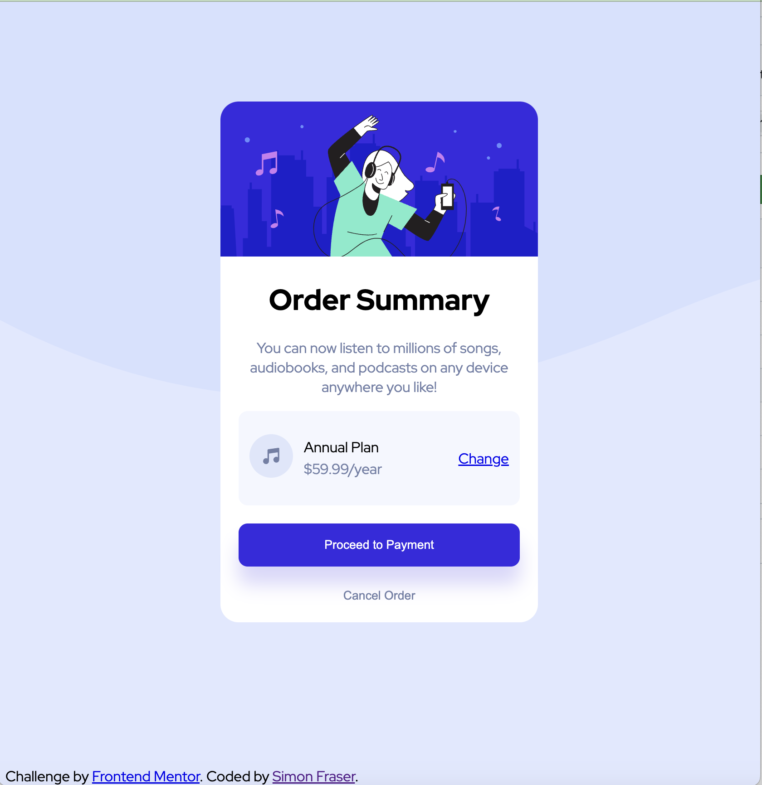

# Frontend Mentor - Order summary card solution

This is a solution to the [Order summary card challenge on Frontend Mentor](https://www.frontendmentor.io/challenges/order-summary-component-QlPmajDUj). 

## Table of contents

- [Overview](#overview)
  - [The challenge](#the-challenge)
  - [Screenshot](#screenshot)
  - [Links](#links)
- [My process](#my-process)
  - [Built with](#built-with)
  - [What I learned](#what-i-learned)
  - [Continued development](#continued-development)
  - [Useful resources](#useful-resources)
- [Author](#author)

## Overview

### The challenge

Users should be able to:

- See hover states for interactive elements

### Screenshot



### Links

- Solution URL: [https://github.com/simoncodes-dev/FEM-Order-Summary-Component](https://github.com/simoncodes-dev/FEM-Order-Summary-Component)
- Live Site URL: [https://simoncodes-dev.github.io/FEM-Order-Summary-Component/](https://simoncodes-dev.github.io/FEM-Order-Summary-Component/)

## My process

### Built with

- Flexbox
- CSS Techniques

### What I learned

In this instance it seemed more appropriate to use standard DIV tags that had descriptive class names for each of the elements, as the semantic markup wasn't completely appropriate. That said, it could be refactored to use semantic markup. 

This is my second project, and the CSS work was less difficult, though I continued to rely on a flexbox guide - and figuring out how to get the item centered in the screen was annoyingly difficult. I ended up setting the container to the height of the viewport and then that seemed to do what I needed to do. 

Trying to align the items in the selected-plan area (the icon, description, and the change button) was more difficult than I thought. I ended up using this code

```css
.selected-plan{
    display: flex;
    justify-content: space-between;
    align-items: center;
    background-color: hsl(225, 100%, 98%);
    padding: 20px 12px;
    border-radius: 10px;
}
.plan-change {
    text-align: right; 
    flex-grow: 1;
}
```

The flex-grow function works, but I don't know why it works, which is probably a problem. 

### Continued development

Continuing to work with CSS despite my dislike of it!

### Useful resources

- [CSS Tricks - A Complete Guide to Flexbox (Properties Section)](https://css-tricks.com/snippets/css/a-guide-to-flexbox/) - Massively useful resource for using Flexbox. 
- [W3Schools CSS Button resource](https://www.w3schools.com/css/css3_buttons.asp) - Reference when skinning the buttons

## Author

- Frontend Mentor - [@simoncodes-dev](https://www.frontendmentor.io/profile/simoncodes-dev)